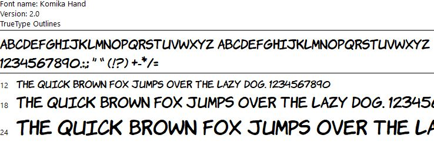

# The Art and Concept of the 84 Badge

## Concept

The concept for this badge was tied to the 3000 Society Game Con which was themed 1984 as it was scheduled to happen on the weekend of the new Wonder Woman 1984 movie release.

So I chose a 1984 theme for the badge which would include Wonder Woman.

I knew early on that I wanted to design the badge to look like a classic comic book cell: square, black on white, and a narrator's block or speach bubbles.
I wanted this badge to tell a story and like any good story it needed heroes and villians.

There were so many characters and things that were related to 1984 it took me a while to figure out what to include and how to make them work together with Wonder Woman.

I started by looking for villians and the two the jumped out at me were The Terminator (movie release and timeframe both 1984) and the evil state from George Orwell's 1984 (book timeframe is 1984).
I wanted to use both of them somehow.
The Terminator would be easy to incorporate, but how to represent an evil state and it's oppression of the people via survielance?
Looking through some inspirational images searches I stumbled upon one of the many book covers for Orwell's 1984 which was just a huge eye.
Then it hit me that this was an 'All Seeing Eye' that could spew destruction.
I played around with having it shoot beams or something, but that didn't tie the villians together the way I wanted.
As I was struggling with this I read a tweet from someone in infosec I follow that mentioned a breach, and it hit me that the All Seeing Eye should be a breach in spacetime that is depositing the Terminator into 1984 for Wonder Woman to battle.

Next I focused on my heroes.
I didn't want Wonder Woman fighting alone, but at the same time I didn't want her parter to steal the show.
So, I needed a lesser hero or something abstract like the All Seeing Eye was for the villians and they/it needed to exist in 1984 or have some plausible reason for being there.
Being one of my favorite movies from that year, The Last Starfighter (movie release and timeframe both 1984) immediately came to mind.
The question became how to incorporate the two heroes.
I figured The Last Starfighter would have to be in his Gunstar in order to help at all against a Terminator.
So the Gunstar would be firing lasers, but what would Wonder Woman be bringing to the battle?
I figured that firing from atmosphere at a small fast target like a Terminator would make him next to impossible to hit.
So, Wonder Woman would have to get up close and personal with the Terminator to hold him in place with her magic lasso in order for The Last Starfigher to be able to hit the target.

My story was complete and the narrator's text basically wrote itself including the ironic way it could just as easily been referencing Information Security heroes fighting a data breach based on modern survielance.

One note on that text: I know that "Heroes" is the correct spelling.  But, it looked odd when I had it typed out and I thought that "Hero's" looked better.  Call it artistic license.

## Art

For the artwork I started by looking for inspiration via google image searches.  As you can imagine there were many images related to Wonder Woman, The Terminator, The Last Starfighter, and George Orwell's 1984.

I struggled with the font for the narrator text.  I finally found one I liked that is called Komika.  It looked to be the closest I could get to the text used in old school comics.

Once I had an idea of how I wanted to represent each of my characters and the font I would use, I started the work of drawing the art using Adobe Illustrator.  
Using a combination of free hand and trace work and several different shading techniques (necessary to keep it truley black on white without shades of grey) I was able to bring it all together.
Once I finished adding a few logo's it was complete.

