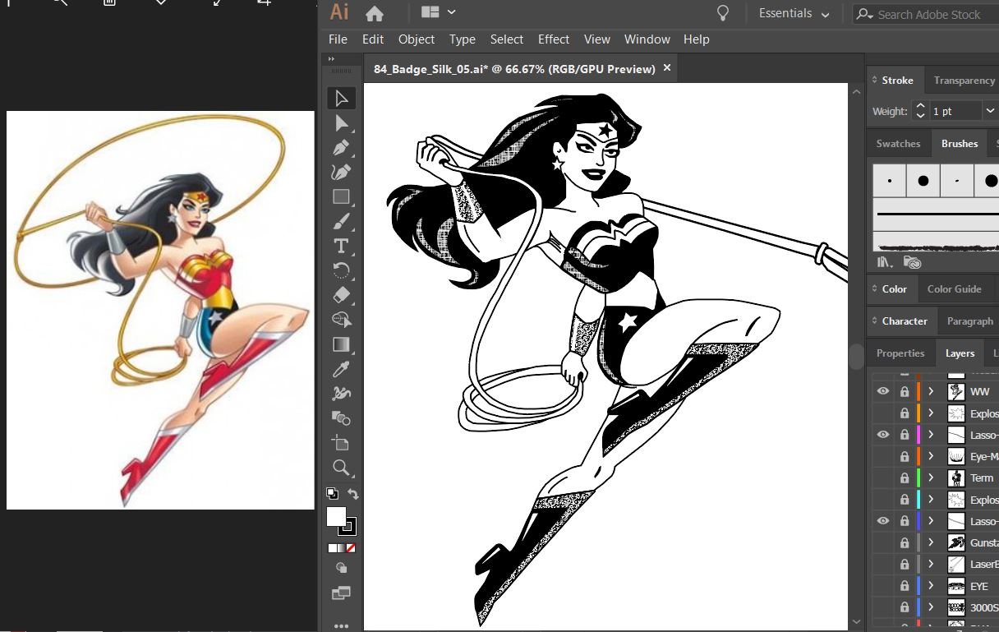

# The Art of the 84 Badge - Details

Here are some additional details about the artwork for the badge.

## Files

All of the artwork files are included in the [84 Badge github repository](https://github.com/gowenrw/84_Badge) including the Adobe Illustrator files, inspiration images and fonts.

Here are a few quick links
*  [My final Adobe Illustrator file](https://github.com/gowenrw/84_Badge/blob/master/art/84_Badge_Silk_05.ai)
*  [A JPG export from the AI file above](https://github.com/gowenrw/84_Badge/blob/master/art/84_Badge_Silk_05_without_edges.jpg)
*  [3000 Society Con Poster using this art](https://github.com/gowenrw/84_Badge/blob/master/art/3000_Society_Con_Poster.jpg)

## Wonder Woman Sketch

After finding the perfect image of Wonder Woman with her lasso to use on the badge I had to sketch it all out in AI to make it all one color.  
This was difficult given all the shading and solid areas.
I used a combination of cross hatch patterns and dots to perform the shading affects I wanted using just one color.

## Terminator Sketch

For the Terminator I couldn't find a single image that portrayed him the way I wanted, which was half Arnold Schwarzenegger and half robot skeleton as the humanoid portion was being blasted away.
So I based it off of a couple of different images to create the Terminator I wanted.
Once again I had to use patterns to provide the shading effects in one color.

## Last Starfighter Gunstar Sketch

For the Last Starfighters Gunstar there were literally dozens of images that could have worked.
The one that I based my sketch from had nice crisp lines (minimizing the pattern shading I would have to do) and it clearly showed the Star League markings.

