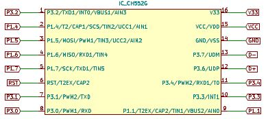
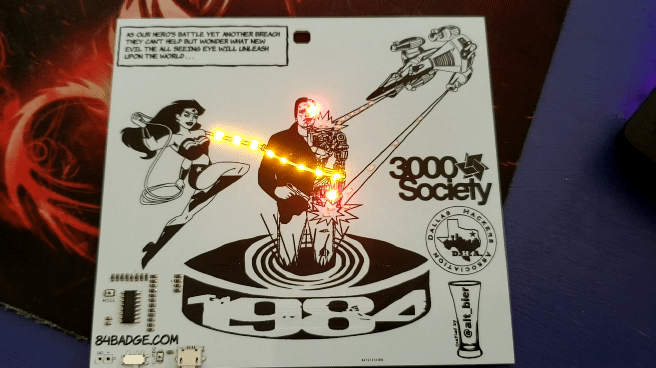
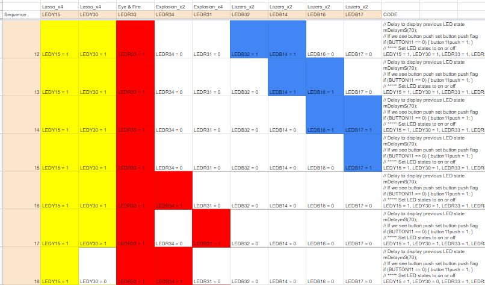

# The Code of the 84 Badge

On this page I will review the badge code for both the development board and the badge PCB.
Both boards have the same electronics and the code works on both.
But the dev board code was to simply test the electronics and had more simple code compared to the badge code.

The Micro Controller used is a CH552G.
The CH55x series of Micro Controllers are based off of an ARM 8051 chipset and can be programmed using [Kiel C51](http://www.keil.com/c51/) or [SDCC](http://sdcc.sourceforge.net/).
I use SDCC (Small Device C Compiler) and will get into more specifics about that on the next page.

## Development board code

For the development board I just needed a quick and dirty test of the electronics.  So I created a simple blink program that will blink the LEDs by color group.


The way the pins are laid out on the CH552G chip are by major pin and sub-pin (e.g. 1.1, 1.2, 3.1, 3.2, etc.).  



So the first things that I have to do is include the Micro Controller header file ch554.h and define the pins followed by setting the SBIT for those pins.  
Note: SBITs refer to the bits that have SFRs (special function registers) on the Micro Controller.

```c
#include <ch554.h>
.
.
#define LEDY30_PIN 0
#define LEDR31_PIN 1
#define LEDB32_PIN 2
#define LEDR33_PIN 3
#define LEDR34_PIN 4
.
.
// P1 = 0x90 P3 = 0xB0
SBIT(LEDY30, 0xB0, LEDY30_PIN);
SBIT(LEDR31, 0xB0, LEDR31_PIN);
SBIT(LEDB32, 0xB0, LEDB32_PIN);
SBIT(LEDR33, 0xB0, LEDR33_PIN);
SBIT(LEDR34, 0xB0, LEDR34_PIN);
.
.
```

With the preliminary setup done I can set up the main function and set those pins up as GPIO (general purpose input and output) pins by calling defined SFR references from the Micro Controller header file ch554.h

```c
void main() {
  .
  .
  // Configure pin 3.0 as GPIO output
  P3_MOD_OC = P3_MOD_OC & ~(1<<LEDY30_PIN);
  P3_DIR_PU = P3_DIR_PU |	(1<<LEDY30_PIN);
  // Configure pin 3.1 as GPIO output
  P3_MOD_OC = P3_MOD_OC & ~(1<<LEDR31_PIN);
  P3_DIR_PU = P3_DIR_PU |	(1<<LEDR31_PIN);
  // Configure pin 3.2 as GPIO output
  P3_MOD_OC = P3_MOD_OC & ~(1<<LEDB32_PIN);
  P3_DIR_PU = P3_DIR_PU |	(1<<LEDB32_PIN);
  // Configure pin 3.3 as GPIO output
  P3_MOD_OC = P3_MOD_OC & ~(1<<LEDR33_PIN);
  P3_DIR_PU = P3_DIR_PU |	(1<<LEDR33_PIN);
  // Configure pin 3.4 as GPIO output
  P3_MOD_OC = P3_MOD_OC & ~(1<<LEDR34_PIN);
  P3_DIR_PU = P3_DIR_PU |	(1<<LEDR34_PIN);
  .
  .
```

Here is an excerpt from ch554.h that defines those SFR references.

```c
SFR(P3_MOD_OC,	0x96);	// port 3 output mode: 0=push-pull, 1=open-drain
SFR(P3_DIR_PU,	0x97);	// port 3 direction for push-pull or pullup enable for open-drain
```

All that is left is to create a loop to turn the LEDs on and off with a delay.

```c
while (1) {
  // Setting the LEDs to on or off
  LEDY30 = 1;
  LEDY15 = 1;
  LEDR31 = 0;
  LEDR33 = 0;
  LEDR34 = 0;
  LEDB32 = 0;
  LEDB14 = 0;
  LEDB16 = 0;
  LEDB17 = 0;
  // Delay controls blink speed
  mDelaymS(300);
  .
  .
```

This is a simple but effective way for me to test out all the electronics on the board.

## 84 Badge code

For the badge code I needed to do a bit more work to get the groups of LEDs to light in the order I wanted them to fire for the effect I was going for.
In addition I needed to program the button to change LED modes and come up with a few different LED patterns to switch between.



I start this code the same way I did for the development board.
I include the Micro Controller header file ch554.h and define the pins followed by setting the SBIT for those pins.
For this board I must also define a couple of variables for the button operations.

```c
#include <ch554.h>
.
.
// define the sub-pins for pin 3
#define LEDY30_PIN 0
#define LEDR31_PIN 1
#define LEDB32_PIN 2
#define LEDR33_PIN 3
#define LEDR34_PIN 4
// define the sub-pins for pin 1
#define BUTTON11_PIN 1
.
.
// assign sub-pins to pins
// P1 = 0x90 P3 = 0xB0
SBIT(LEDY30, 0xB0, LEDY30_PIN);
SBIT(LEDR31, 0xB0, LEDR31_PIN);
SBIT(LEDB32, 0xB0, LEDB32_PIN);
SBIT(LEDR33, 0xB0, LEDR33_PIN);
SBIT(LEDR34, 0xB0, LEDR34_PIN);
SBIT(BUTTON11, 0x90, BUTTON11_PIN);
.
.
// 1 byte integer for putton push flag - no bool type available
uint8_t button11push=0;

// 1 byte integer for LED Mode (controlled by button)
// Modes 1 is the default start mode
uint8_t ledmode=1;
.
.
```

With the preliminary setup done I can set up the main function and set the LED pins up as GPIO (general purpose input and output) pins by calling defined SFR references from the Micro Controller header file ch554.h

```c
void main() {
  .
  .
    // setup pin 3
    // Configure pin 3.0 as GPIO output
    P3_MOD_OC = P3_MOD_OC & ~(1<<LEDY30_PIN);
    P3_DIR_PU = P3_DIR_PU |	(1<<LEDY30_PIN);
    // Configure pin 3.1 as GPIO output
    P3_MOD_OC = P3_MOD_OC & ~(1<<LEDR31_PIN);
    P3_DIR_PU = P3_DIR_PU |	(1<<LEDR31_PIN);
    // Configure pin 3.2 as GPIO output
    P3_MOD_OC = P3_MOD_OC & ~(1<<LEDB32_PIN);
    P3_DIR_PU = P3_DIR_PU |	(1<<LEDB32_PIN);
    // Configure pin 3.3 as GPIO output
    P3_MOD_OC = P3_MOD_OC & ~(1<<LEDR33_PIN);
    P3_DIR_PU = P3_DIR_PU |	(1<<LEDR33_PIN);
    // Configure pin 3.4 as GPIO output
    P3_MOD_OC = P3_MOD_OC & ~(1<<LEDR34_PIN);
    P3_DIR_PU = P3_DIR_PU |	(1<<LEDR34_PIN);
  .
  .
```

The last section of code took the most time as I had to create my loop and have it check for an LED mode and a button push which would change that LED mode.

```c
// ********************************
// ********* Primary Loop *********
// ********************************
while (1) {
    // ********************************
    // ********** LED MODE 3 **********
    // ********************************
    if (ledmode == 3) {
      // *****
      // ***** This mode keeps all LEDs ON
      // *****
      // Delay to display previous LED state
      mDelaymS(300);
      // If we see button push set button push flag
      if (BUTTON11 == 0) { button11push = 1; }
      // ***** Set LED states to on or off
      LEDY30 = 1, LEDY15 = 1, LEDR31 = 1, LEDR33 = 1, LEDR34 = 1, LEDB32 = 1, LEDB14 = 1, LEDB16 = 1, LEDB17 = 1;
      // ***** End of this LED mode
    }
    // ********************************
    // ********** LED MODE 2 **********
    // ********************************
    if (ledmode == 2) {
      .
      .
      // ***** End of this LED mode
      // *****
    }
    // ********************************
    // ***** LED MODE ADJUSTMENTS *****
    // ********************************
    // If button was pushed during the cycle above then flag should be set
    if (button11push == 1) {
      // Increase LED Mode value
      ledmode = ledmode + 1;
      // Check if LED Mode value is beyond max value and if so set to min value
      if (ledmode > 3) { ledmode = 1; }
      // Reset button push flag
      button11push = 0;
    }
    // ********************************
    // ****** END OF MODE LOOPS *******
    // ********************************
}
// ********************************
// ***** END OF PRIMARY LOOP ******
// ********************************
```

On each delay I would look for the button being pushed and if it was then I would set the variable button11push to 1 which would trigger the incrementing of the ledmode variable and the reset of the button11push variable at the end of the current LED mode loop iteration.

Most of the code is in the LED mode 1 which is the default LED mode and the one with the most complex pattern for the artwork effect.

In order to plan out how I wanted the LEDs to turn on or off for this LED mode I used google sheets.
I laid out the LEDs with conditional formatting and some scripting that would spit out the bit of code needed for each LED transition.



I think it turned out fairly well.
But I am looking at changing the yellow LEDs to use a PWM setting instead of simple on/off to provide more of a glowing effect.

This is the end of the code review.

Thanks for reading it.
