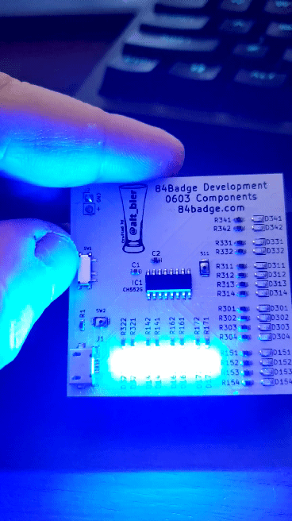

# The Code of the 84 Badge

On this page I will review the badge code for both the development board and the badge PCB.
Both boards have the same electronics and the code works on both.
But the dev board code was to simply test the electronics and had more simple code compared to the badge code.

The Micro Controller used is a CH552G.
The CH55x series of Micro Controllers are based off of an ARM 8051 chipset and can be programmed using [Kiel C51](http://www.keil.com/c51/) or [SDCC](http://sdcc.sourceforge.net/).
I use SDCC (Small Device C Compiler) and will get into more specifics about that on the next page.

## Development board

For the development board I just needed a quick and dirty test of the electronics.  So I created a simple blink program that will blink the LEDs by color group.



The way the pins are laid out on the CH552G chip are by major pin and sub-pin (e.g. 1.1, 1.2, 3.1, 3.2, etc.).  

So one of the first things that I do is include the Micro Controller header file and define the pins followed by setting the SBIT for those pins.  
Note: SBITs refer to the bits that have SFRs (special function registers) on the Micro Controller.

```c
#include <ch554.h>
.
.
#define LEDY30_PIN 0
#define LEDR31_PIN 1
#define LEDB32_PIN 2
#define LEDR33_PIN 3
#define LEDR34_PIN 4
.
.
// P1 = 0x90 P3 = 0xB0
SBIT(LEDY30, 0xB0, LEDY30_PIN);
SBIT(LEDR31, 0xB0, LEDR31_PIN);
SBIT(LEDB32, 0xB0, LEDB32_PIN);
SBIT(LEDR33, 0xB0, LEDR33_PIN);
SBIT(LEDR34, 0xB0, LEDR34_PIN);
.
.
```

With that done within the main function I can set those pins up as GPIO (general purpose input and output) pins by calling defined SFR references from the Micro Controller header file ch554.h

```c
void main() {
  .
  .
  // Configure pin 3.0 as GPIO output
  P3_MOD_OC = P3_MOD_OC & ~(1<<LEDY30_PIN);
  P3_DIR_PU = P3_DIR_PU |	(1<<LEDY30_PIN);
  // Configure pin 3.1 as GPIO output
  P3_MOD_OC = P3_MOD_OC & ~(1<<LEDR31_PIN);
  P3_DIR_PU = P3_DIR_PU |	(1<<LEDR31_PIN);
  // Configure pin 3.2 as GPIO output
  P3_MOD_OC = P3_MOD_OC & ~(1<<LEDB32_PIN);
  P3_DIR_PU = P3_DIR_PU |	(1<<LEDB32_PIN);
  // Configure pin 3.3 as GPIO output
  P3_MOD_OC = P3_MOD_OC & ~(1<<LEDR33_PIN);
  P3_DIR_PU = P3_DIR_PU |	(1<<LEDR33_PIN);
  // Configure pin 3.4 as GPIO output
  P3_MOD_OC = P3_MOD_OC & ~(1<<LEDR34_PIN);
  P3_DIR_PU = P3_DIR_PU |	(1<<LEDR34_PIN);
  .
  .
```

Here is an excerpt from ch554.h that defines those SFR references.

```c
SFR(P3_MOD_OC,	0x96);	// port 3 output mode: 0=push-pull, 1=open-drain
SFR(P3_DIR_PU,	0x97);	// port 3 direction for push-pull or pullup enable for open-drain
```

With that complete I am ready for a loop to turn the LEDs on and off with a delay.

```c
while (1) {
  // Setting the LEDs to on or off
  LEDY30 = 1;
  LEDY15 = 1;
  LEDR31 = 0;
  LEDR33 = 0;
  LEDR34 = 0;
  LEDB32 = 0;
  LEDB14 = 0;
  LEDB16 = 0;
  LEDB17 = 0;
  // Delay controls blink speed
  mDelaymS(300);
  .
  .
```
