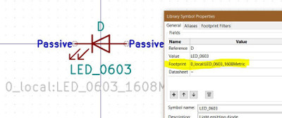
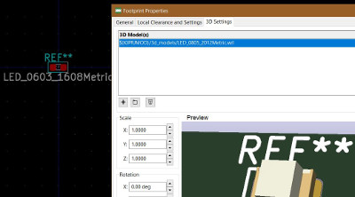
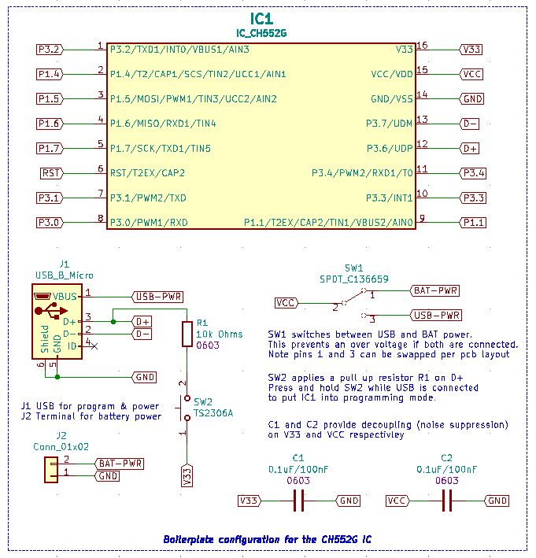
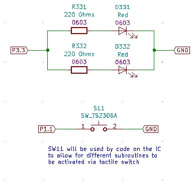
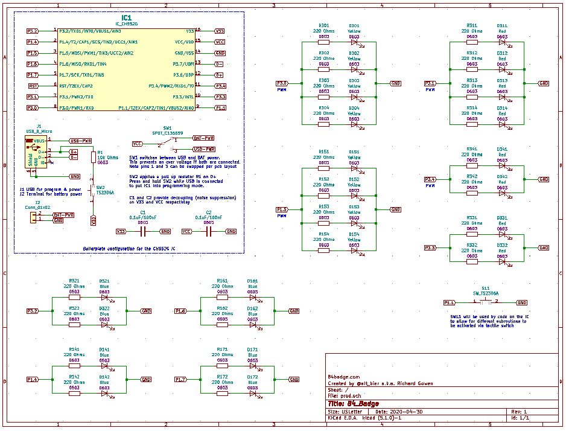

# The EDA work on the 84 Badge - Schematic

The schematic work usually takes me just as long as the PCB work since it is during the schematic design process that I identify new components I will be using.

I believe that the electrical schematic design is the most important part of the process since no amount of work in the PCB design can fix a flawed electrical design.

## Component Design Files

When I identify a new component I'll be using, even one as simple as a resistor, I take the time during schematic design to copy the component schematic symbol and footprint and 3d model files to the local project library, or create them from scratch if they don't exist in the KiCad library.

It is important to note that the three component design file types can be interconnected for convinience.
A schematic symbol file can reference a footprint file which can reference a 3d model file.
I take the time now to incorporate these references as it saves time later.

Having previously worked with the CH552G Micro Controller I was aware of all the basics to design with it.

On my previous design for the BSidesDFW conference badge I built from scratch the schematic symbol and footprint and 3D model for this chip and other components it required (USB connector, power switch, etc.).

This left just the new 0603 components I needed to add to the local project library.
These were all readily available in the KiCad library and was just a matter of copying over.

## Schematic Design

The first thing that I put into the schematic design was the CH552G IC and its basic required components since I knew this part of the design from my previous badge creation.

This IC requires a USB connector, two capacitors for regulating the 3.3V and 5V signals, a 10K pull up resistor tied to a tactile switch which will put the IC into programming mode, and finally a toggle switch to control Battery vs. USB power source.

I placed the IC and its basic required components together into a CH552G boilerplate section that I will be able to reuse in future projects.

With this done I focused on the remaining tactile switch and the 24 LEDs with thier supporting resistors.

Given that I was going to require more LEDs than the number of IC pins I had to control them I grouped the LEDs in parallel on each IC pin.
This grouping has all 24 LEDs controlled by 9 pins on the IC.
These groupings were not all equal as I grouped them based on thier functionality in the badge design.

This completes the schematic review.

[You can download a PDF of the schematic file here.](https://github.com/gowenrw/84_Badge/raw/master/eda/prod/snapshots/84badge_prod_schematic.pdf)

