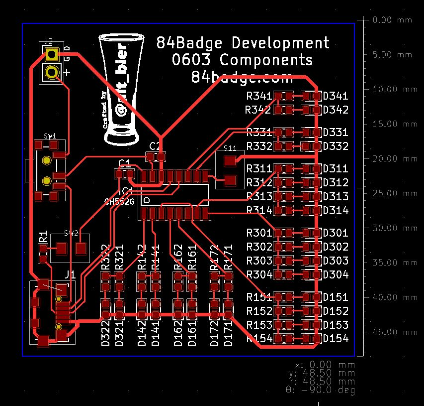

# The EDA work on the 84 Badge - Dev PCB

The development board was just a quick way to test out the electronics.
So, I wanted to keep it a small and simple as possible to keep manufacturing costs to a minimum.

## PCB Layout

As it turns out I was able to get all the components to fit into a 48mm (1.9in) square.

I was also able to get all the traces onto one layer so that no vias were required.

It was a tight fit but everything worked perfectly enough that I was able to move the electrical design to the prod project with no modifications.

This completes the Dev PCB review (it was simple so there was not much to review).

[You can download a PDF of the Dev PCB file here.](https://github.com/gowenrw/84_Badge/raw/master/eda/dev/snapshots/84badge_dev_pcb.pdf)

