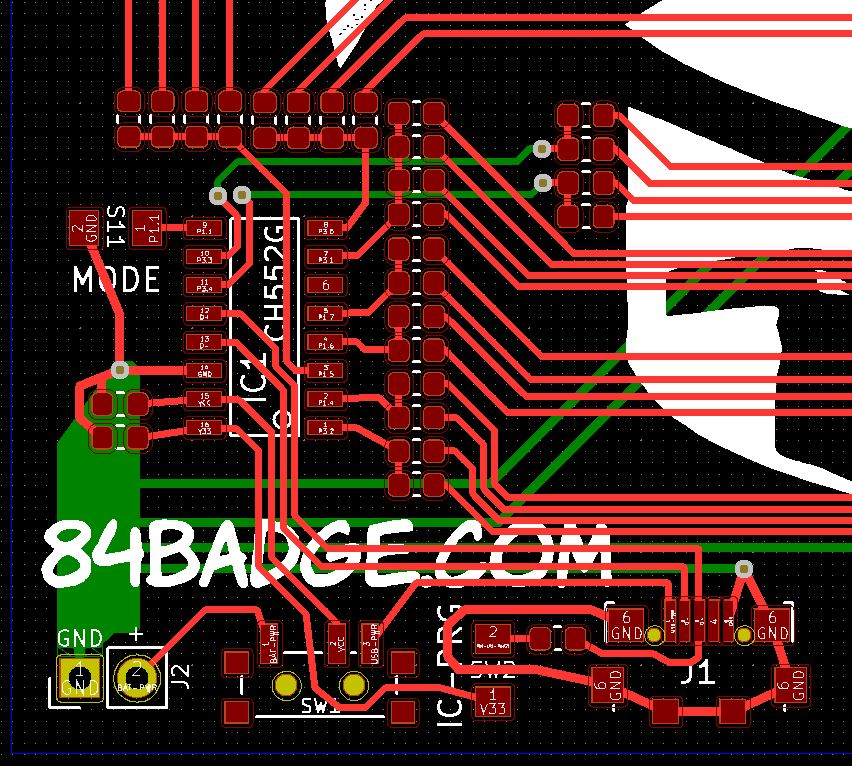
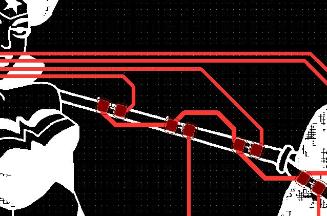
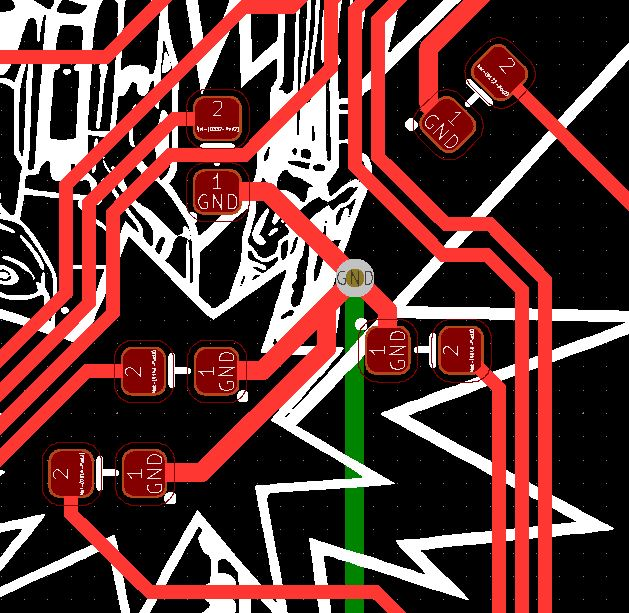
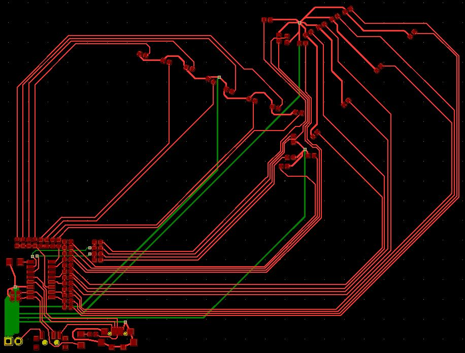
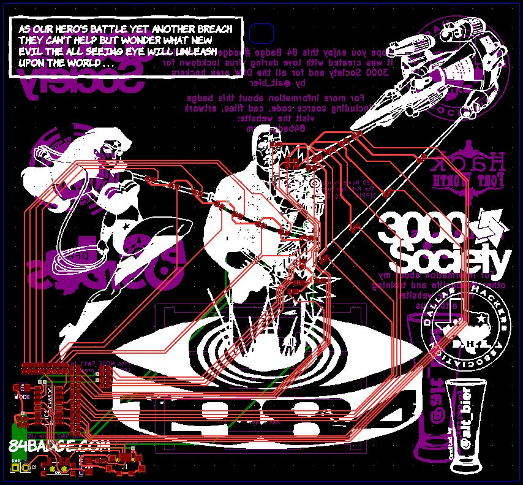

# The EDA work on the 84 Badge - Prod PCB

The production board was a much more difficult proposition than the development board even with tested electronics.

I had to size it to present the artwork properly and fit all the components onto the PCB in such a way as to not detract from that artwork.

## PCB Layout

I decided to put most of the components in a corner where they would be out of the way of the artwork.

This had the added effect of becoming part of the artwork as the resistors appear to make a sort of box that Wonder Woman is launching herself from.

It also helped in my assembly since having most of the components in a small area of the PCB allowed my manual pick and place machine (my hands holding tweezers) to get the parts on the board faster.

With most of the components in the corner done I focused on placing the LEDs next.

I had three different colors of LEDs grouped in different quantities to serve different purposed.  
So, I had to match up the exact LED I wanted in each place within the artwork of the board.

In some cases this was easy to do.

In some cases this was more difficult.

Once the LEDs were placed I had to run all the traces to them.

This was challenging because unlike on my development board I wasn't lining these up in neat lines but rather all over the board.

The help with this and avoid complicated routing I put the ground traces on the back of the board and used vias to connect them to the front.

To minimize the number of vias needed I chained several LED grounds together to be routed to a ground via.

Once all the placement and trace routing was complete I added some logo's and some text to the back of the board and it was finished.

This completes the Prod PCB review.

[You can download a PDF of the Prod PCB file here.](https://github.com/gowenrw/84_Badge/raw/master/eda/prod/snapshots/84badge_prod_pcb.pdf)

